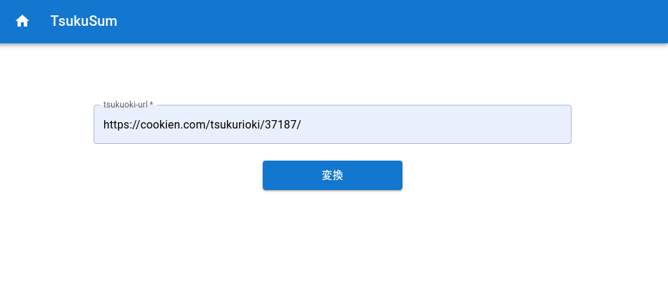
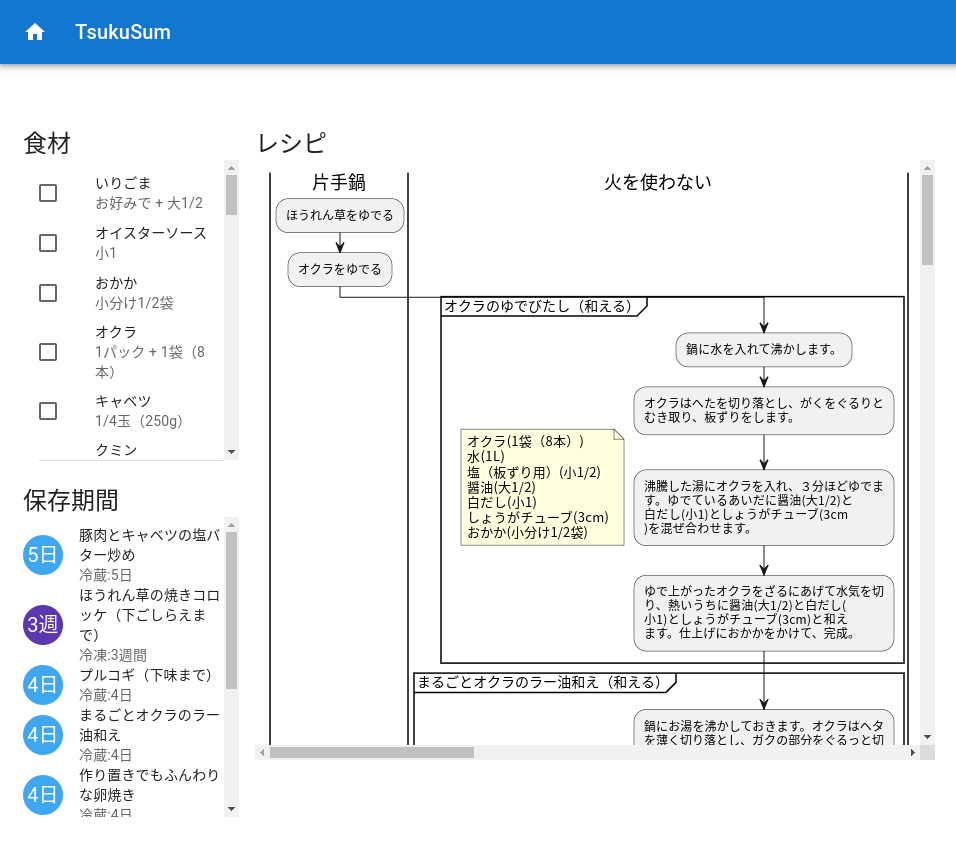

# TsukuSum

## 概要

作りおきレシピサイトのつくおきの1週間分まとめてつくるページのURLからレシピの手順を要約するウェブアプリケーションです。

すべてオンメモリで処理するので、情報は残りません

レシピのフローチャートはplantumlを使用して表示しています


## Getting started

### linux server

build.shスクリプトを実行します

```bash
./build.sh
```

backendディレクトリに移動してサーバーを起動します

```bash
cd backend
npm run start
```

<http://localhost:8080>にアクセスするとアプリを使用できます

### docker

docker buildをクローンしたレポジトリのルートディレクトリ上で実行します

```bash
docker build -t tsukusum .
```

ビルドが完了したら以下の用にコマンドを入力すると起動します

```bash
docker run --rm -d --name tsukusum -p 8080:8080 tsukuoki-summarizer:latest
```

<http://localhost:8080>にアクセスするとアプリを使用できます

## 環境変数

|項目|説明|例|
|---|---|---|
|TS_PORT| サーバーを起動するポート。デフォルトでは8080番を使用する | 3000 |
|TS_PLANTUMLE|plantumlのサーバーのURL。指定しない場合は`https://plantuml.com/plantuml`が指定される| `https://plantuml.com/plantuml` |


## アプリ使用方法

アプリはホーム画面とサマリー画面の2つの画面で構成されます

起動したサーバーが localhost の 8080 番ポートの場合,<http://localhost:8080>にアクセスすると以下のホーム画面が表示されます

テキスト入力フォームに，つくおきの1週間分をまとめたページのURLをコピー＆ペーストして変換ボタンを押します



変換ボタンを押すと画面遷移して、ローディング画面が表示されます．

データの取得が完了すると以下の用にレシピのサマリーが表示されます



サマリー画面では，レシピに使用する食材一覧(調味料も含む)と, 料理の保存方法と保存期間,詳細なレシピのフローチャートで確認することができます.
